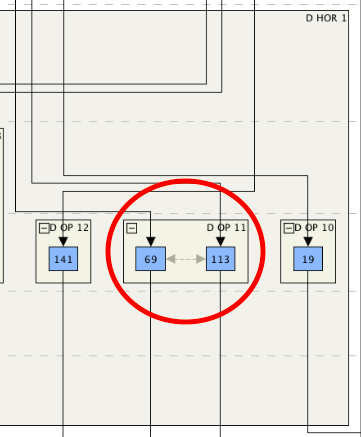
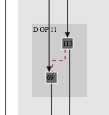

# Harris Matrix Visualization

## Converting Harris Matrix Composer XML

The command line utility `hmc2json.py`, wrriten in Python 3.5, will convert a HMC-style GraphML file to JSON like so:

```sh
$ ./hmc2json.py data.xml data.json
```

## Installation

Install required libraries:

```sh
$ bower install klayjs-d3
```

## Visualization

[KLayJS-D3](https://github.com/OpenKieler/klayjs-d3) is the main workhorse of these visualizations. The library provides a hierarchical, orthogonal graph layout algorithm that determines node placement and edge routing.

**Examples:**

- [Sector D](https://semerj.github.io/harris_matrix/examples/sector_d/)
- [PEA](https://semerj.github.io/harris_matrix/examples/pea/)
- [A2](https://semerj.github.io/harris_matrix/examples/a2/)

## Differences with Harris Matrix Composer

KLayJS-D3 [does *not* support](http://rtsys.informatik.uni-kiel.de/confluence/questions/14516313/can-klaylayered-consider-previous-node-coordinates#Layering) `"CONTEMPORARY"` (i.e. bidirectional) edges as in Harris Matrix Composer. Example:



Instead, these visualizations provide undirected, dashed, and colored edges to signify `"CONTEMPORARY"` relationships between nodes. Example:


